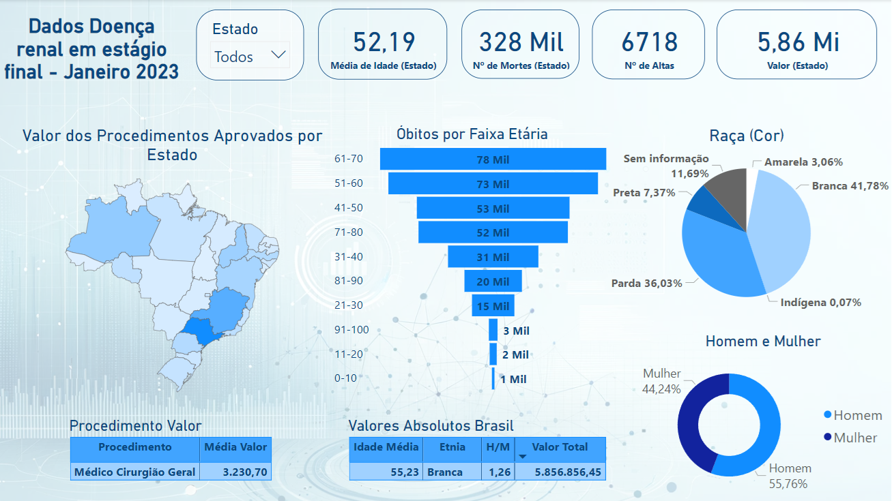
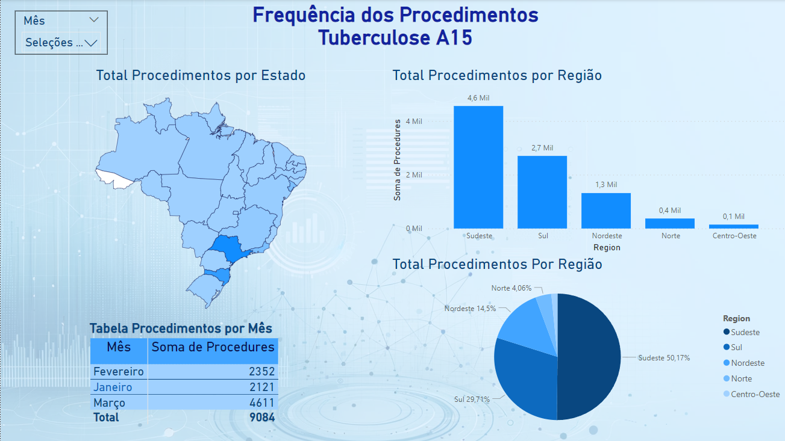

# DataSUS EDA Python
This repository contains a series of Python notebooks and a Dash application designed for the analysis and visualization of data from DataSUS Each component is described below:

- Dashboard n180 DataSUS

- Dashboard A15 DataSUS

# Python Notebooks
- **tuberculose_012023.ipynb**: Analysis of tuberculosis data for January 2023.
- **tuberculose_022023.ipynb**: Analysis of tuberculosis data for February 2023.
- **tuberculose_032023.ipynb**: Analysis of tuberculosis data for March 2023.
- **tuberculose_0102032023.ipynb**: Combined analysis of tuberculosis data for the first quarter of 2023 (January, February, and March).
- **n180_EDA.ipynb**: Analysis of doença renal estágio final for January 2023.
- **n180_EDA_2.ipynb**: calculations relevant to the N180 project.

# Dash Application
- **tuberculose_dash.py**: A Dash application for visualizing tuberculosis data. This app provides interactive charts and maps to explore the data by state, region, and month. The application is designed to be user-friendly and provides insights into the distribution and trends of tuberculosis cases across different regions of Brazil.
# Features
- Selection of state, region, and month for detailed data viewing.
- Interactive charts and maps displaying the distribution of tuberculosis cases.
- A table view for detailed data examination.
# Style
- **style.css**: The stylesheet for the Dash application. It contains custom styles that enhance the visual aspect of the web application, including layout adjustments, color schemes, and font settings.
# Setup and Running
- Ensure you have Python installed on your system.
- Install the required libraries using pip install -r requirements.txt (you may need to create this file listing all the required packages such as dash, pandas, plotly, etc.).
- Run the Dash application by executing python tuberculose_dash.py in your terminal.
